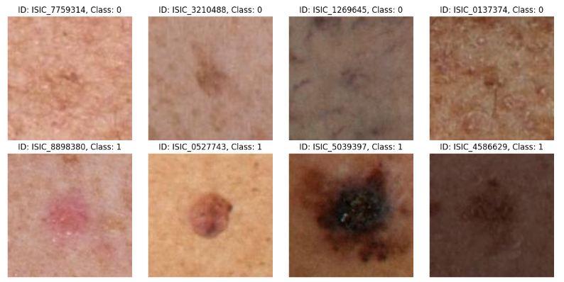

# ISIC_2024

## Постановка задачи
Необходимо разработать нейросеть с бинарной классификацией, для выявления раковых заболеваний среди новообразований кожи, полученных с трехмерных фотографий всего тела. В результате анализа нейросеть будет выдавать ответ, является ли поражение (родинка) злокачественным, или доброкачественным, и процент вероятности. Датасет состоит из снимков поражений (1 родинка на один снимок), и таблицы с метаданными по каждому снимку.

Ссылка на датасет: https://www.kaggle.com/competitions/isic-2024-challenge/data  
Датасет с изображениями хранится в hdf5 файле, названия файлов, метки классов и метаданные хранятся в csv файле.

*Примеры из датасета*  


```
Распределение классов:
0    400666
1       393
```

## Решение
Злокачественных примеров очень мало, поэтому при обучении был использован метод кросвалидации с применением StratifiedGroupKFold, с разбиением на 5 folds и группировкой по полю patient_id.
Провел эксперименты с различными гиперпараметрами, дообучил модели EfficientNet и ResNet.
Ноутбук с экспериментами: [ISIC_2024_all_exps.ipynb](ISIC_2024_all_exps.ipynb)

## Итоги
По результатам проведенных экспериментов был достигнут pAUC 0.1501 на тестовых данных конкурса при TPR>=0.8.
Для достижения более высокого результата необходимо добавлять анализ табличных данных.

## Использованные инструменты:
- **Язык программирования:** Python
- **Библиотеки:** Pytorch, NumPy, Matplotlib, Pandas, Sklearn, Pillow, Timm, Albumentations, H5py, Tqdm
- **Среда разработки:** Jupyter Notebook / Google Colab / Kaggle Notebook
